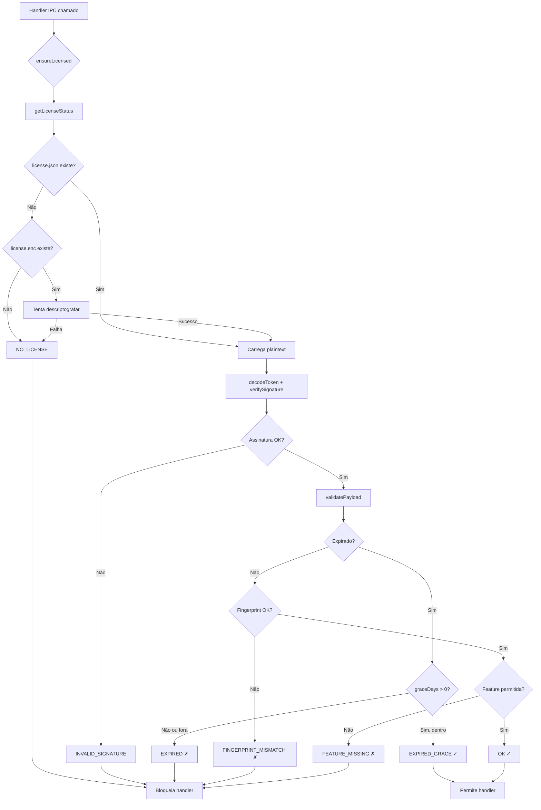
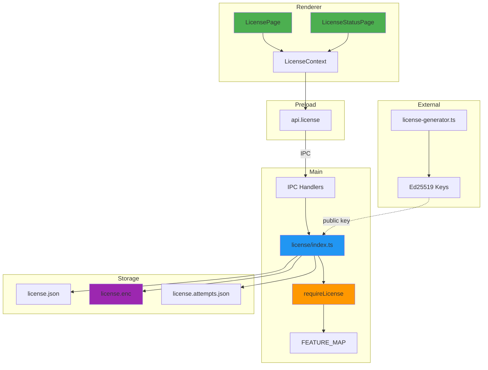

# Licença offline v2 (PoC)

## Objetivo
Implementar licenciamento offline com validação forte no processo principal do Electron, enforcement por feature e camadas para dificultar bypass.

## Visão geral
- **Assinatura:** payload canônico + assinatura Ed25519.
- **Armazenamento:** `license.json` para leitura simples e cópia criptografada `license.enc` (AES-256-GCM) derivada de `fingerprint+nonce`.
- **Fingerprint:** SHA-256 de `machine-id | hostname | platform` via `node-machine-id`.
- **Enforcement:** checagem central em `requireLicense()` + `FEATURE_MAP` para gating de recursos.
- **Rate limit:** contador persistido em `license.attempts.json` com bloqueio temporário após 5 falhas.
- **Compatibilidade:** payload versão 1 ou 2; v2 adiciona campos de hardening.

## Payload v2
Campos aceitos (ver `src/main/license/index.ts`):
- `licenseId`, `productId`, `customerId`, `issuedAt`, `expiresAt`, `features[]`, `maxActivations`, `hwFingerprint`, `nonce`.
- **Novos:** `allowedFingerprints[]`, `graceDays`, `revocationListVersion`, `productPath`, `version: 1 | 2`.

## Fluxo de ativação/validação

### Diagrama de ativação

```mermaid
sequenceDiagram
    participant U as Usuário
    participant R as Renderer (React)
    participant P as Preload
    participant M as Main Process
    participant FS as Filesystem
](image-1.png)](image-1.png)](image.png)
    U->>R: Cola token de licença
    R->>P: api.license.activate(token)
    P->>M: ipcRenderer.invoke("license:activate")
    
    M->>M: decodeToken(token)
    M->>M: verifyPayloadSignature(payload, sig)
    
    alt Assinatura inválida
        M-->>R: {valid: false, code: "INVALID_SIGNATURE"}
    else Assinatura OK
        M->>M: validatePayload(payload, fingerprint)
        
        alt Payload inválido (expirado, fingerprint, etc)
            M-->>R: {valid: false, code: "EXPIRED|FINGERPRINT_MISMATCH|..."}
        else Payload válido
            M->>FS: Salva license.json (plaintext)
            M->>FS: Salva license.enc (AES-GCM)
            M->>M: resetAttempts()
            M-->>R: {valid: true, code: "OK"}
        end
    end
    
    R->>U: Exibe status da licença
```

### Diagrama de validação (requireLicense)



### Arquitetura geral



### Passos resumidos
1) Renderer chama IPC `license:activate` com o token base64url.
2) Main decodifica, verifica assinatura, aplica validações (expiração + carência, fingerprint/whitelist, productPath).
3) Persistência dupla: plaintext + cópia criptografada (AES-GCM com chave derivada de fingerprint/nonce).
4) `requireLicense(feature?)` é usado para proteger handlers; retorna `FEATURE_MISSING` quando o recurso não está licenciado.
5) `getLicenseStatus` tenta `license.json`; se ausente, tenta descriptografar `license.enc`.

## Scripts e geração
- `scripts/license-generator.ts`: gera tokens v1/v2. Flags úteis:
  - `--version=2` (padrão), `--features=full,xyz`, `--grace=7`, `--allowed=f1,f2`, `--productPath=/app`, `--revocation=1`, `--fingerprint=<id>`.

## IPC exposto
- `license:status`, `license:activate`, `license:fingerprint` (ver `src/main/ipc/index.ts`).
- Preload expõe `window.api.license` com esses métodos (tipagens em `src/preload/index.d.ts`).

## UI
- Páginas: `LicensePage` (ativação) e `LicenseStatusPage` (info), navegáveis pelo menu lateral (`Sidebar`).
- Contexto React: `LicenseContext` provê `status`, `activate()`, `refresh()`.

## Medidas de segurança implementadas
- Assinatura Ed25519 canônica para evitar reordenação de campos.
- Gating por feature com fallback para `full`.
- Grace period controlado por `graceDays`.
- Bind a hardware: `hwFingerprint` ou `allowedFingerprints`.
- Bind a instalação: `productPath` opcional.
- Armazenamento criptografado AES-GCM com chave derivada de fingerprint+nonce.
- Rate limit persistente entre reinícios (tentativas e bloqueio temporário).
- Checagens de integridade entre payload salvo e payload do token.

## Observações do PoC
- Chaves de teste (pública/privada) estão no repositório apenas para validação local; substituir por chaves reais antes de produção e remover a privada do repo.
- `license.enc` usa o `nonce` do payload; sem o plaintext com nonce não descriptografa.

## Execução rápida
```bash
npm install
npm run typecheck
npm run build
```

## Próximos passos sugeridos
- Remover a chave privada de teste do repositório e adicionar ao `.gitignore`.
- Adicionar mensagens específicas na UI para `EXPIRED_GRACE` / `FEATURE_MISSING`.
- Opcional: anti-debug/tamper (checksums, watchdog, clock-skew) e revogação/CRL offline.
